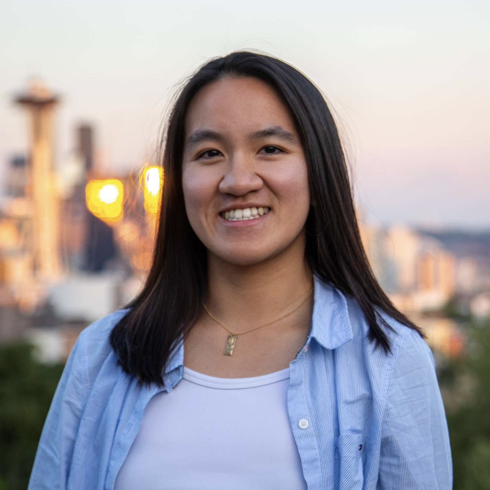

# Hi, I'm Caroline ʕ·͡ˑ·ཻʔ

I'm a senior + coterm from Fredericksburg, VA studying CS (CompBio, AI) and French. I have a broad range of technical experiences spanning scaled data processing and analysis, data security, and web / mobile development, as well as expertise in financial management and public engagement. I'm excited about exploring novel applications of computer science in nontechnical fields, particularly in promoting sustainability and free artistic and cultural expression. Check out my [Github](https://github.com/cmvan) and feel free to reach out via [LinkedIn](https://www.linkedin.com/in/caroline-van/) or email at cmvan@stanford.edu

## Technical Experience

### Uber Technologies

_Software Engineering Intern, Data Security Team (June - September 2023)_

- Fortified delegation token security by implementing server-side Kerberos authentication into Uber’s centralized token handler
- Integrated Kerberos authentication credentials into company-standard secrets protocol, minimizing security risks via secrets rotation
- Slashed key-tab exposure by over 1000-fold by building Kerberos clients in **Python** and **Java** with ticket-caching capabilities
- Enabled authentication of over 1.5 million daily delegation token HTTP requests via Kerberos by reconfiguring core data services

### Stanford Vietnamese Student Association

_Web Developer, Webmaster (November 2021 – June 2023)_

- Elucidated the group’s rich, 30+ year history in a user-friendly events archive crafted using **ReactJS** & **AirTable RESTful API**
- Authored documentation for website maintenance to simplify oversight for non-technical users
- Facilitated biweekly team meetings to coordinate efforts among a 4-person team

### International Genetically Engineered Machine Competition (iGEM), Stanford Team

_Project Manager, Bioinformatician, Web Developer, Graphics Designer (February 2022 – November 2022)_

- Accelerated retrieval by 50% by programming a **Python** web-scraper to efficiently fetch protein data from the UniProt database
- Identified 3 potential polystyrene-degrading proteins among 20+ candidates by devising a Python proteome mining tool
- Developed the team website independently using **ReactJS** and **SCSS** and configured custom **GitLab CI/CD** pipelines ([Github](https://github.com/cmvan/2022-stanford-igem-wiki))
- Won silver for project depth + impact, clarity of documentation via the website, and caliber of our two 15-minute presentations

### Good Lab, Department of Applied Physics at Stanford University

_Undergraduate Computational Researcher (June 2021 – January 2022)_

- Processed and analyzed over 600 GB of gut DNA data from fecal microbiota transplants (FMT) using **Python** and **Bash** ([Github](https://github.com/cmvan/good_fmt))
- Visualized several ecological metrics for donor and recipient bacteria following FMT via more than 150 charts using **Matplotlib**
- Delivered findings on the ecological dynamics between donor and recipient strains after FMT to over 100 students and faculty

## Financial and Public Engagement Experience

### Bridge Peer Counseling Center

_Peer Counselor, Counselor Mentor (January 2022 - Present)_

- Guide students in navigating their emotions and devising solutions to their troubles for a minimum of 3 hours per week
- Provide comprehensive feedback to counselors-in-trainings in over 50 mock counseling sessions to date

### Stanford Vietnamese Student Association

_Financial Officer (May 2022 - June 2023)_

- Secured an unparalleled 300% increase in funding from the Associated Students of Stanford University
- Attained complete financial transparency by overhauling internal financial documentation via a robust budget tracker
- Enhanced budget and reimbursement coordination and reconciliation to achieve a 97% first-time reimbursement approval rate

_Public Relations Co-Chair (May 2021 - June 2022)_

- Spearheaded an unprecedented multimedia archival campaign, achieving a 500% increase in photos and videos documented
- Reinvigorated the group’s Instagram page, prompting a 300% increase in posts and a 700% increase in likes versus prior years
- Crafted customized weekly newsletters to market the organization’s events

## Skills

### Technical Languages

- Python, Java, C++, C, HTML/CSS, Sass/SCSS, JavaScript, Typescript, Bash/Unix scripting, SQL, YAML

### Tools and Frameworks

- GitLab, Bootstrap, GSSAPI, React Native, Next, Python Django, Flask

### Libraries

- React.js, Kerberos, Pandas, NumPy, Matplotlib, Biopython

### Foreign Languages

- French, Vietnamese
