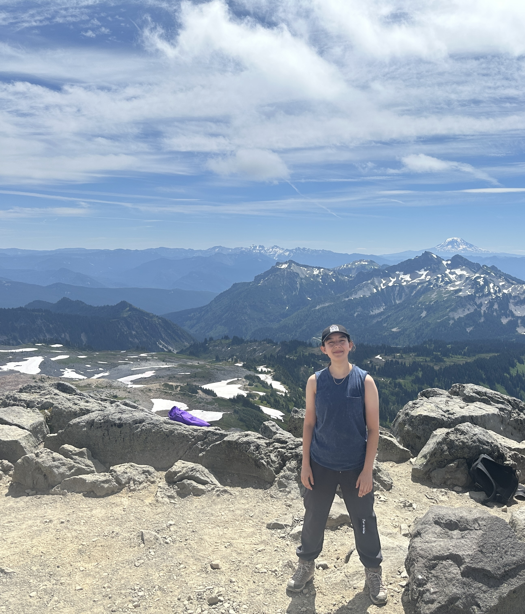
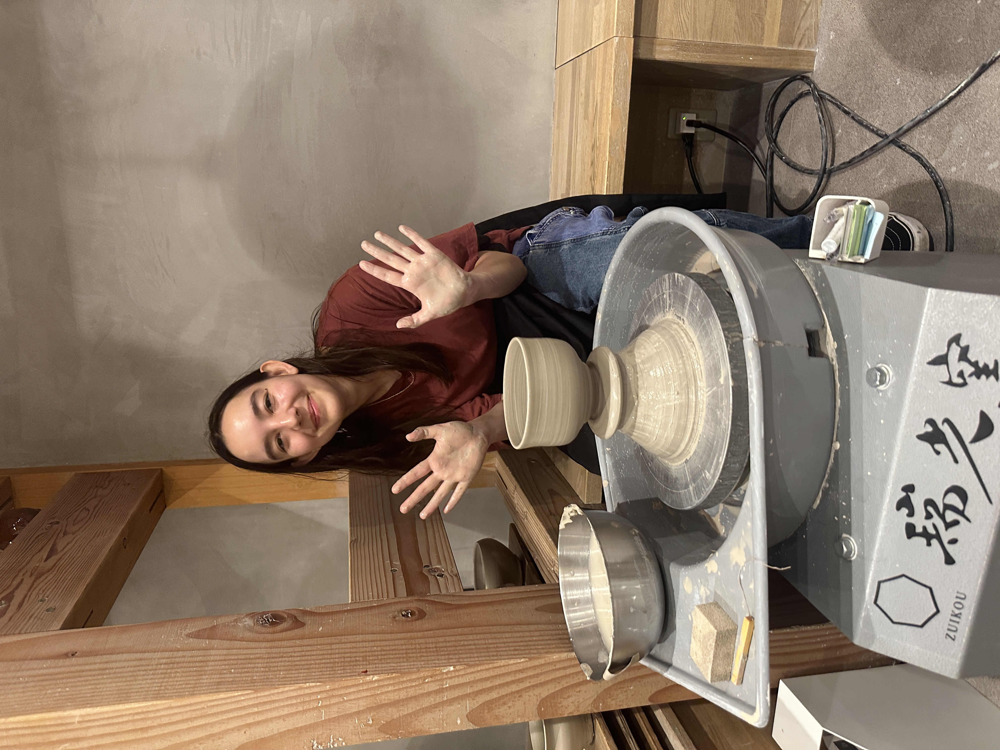

# Hello! My name is Ashley Raigosa

## About Me

I'm a senior in Computer Science on the Systems track and am coterming in Computer Science *also* on the Systems track (couldn't get enough of it). My specialties include embedded systems, low-level programming, high performance computing, and operating systems. I've dealt a lot with releasing software for production, managing databases, and creating user-facing products. I'm excited to meet everyone!

## Skills
Languages: C++, C (bare-metal, RISC-V), Python (Circuit Python, pandas, TensorFlow, scikit-learn, numpy, matplotlib), ISPC, Go, Unix Shell, JavaScript, MATLAB, Java

Software Skills: Git, Docker, CMake, SEGGER (JLink), arm embedded toolchain, GDB, Linux (RHEL 9), linker files, CI/CD (GitLab, Argo CD), AWS Products (Lambda, S3, Cloudwatch, IAM), Kubernetes (K9s), CUDA, compute clusters, APIs (GraphQL, REST APIs), Terraform, web development (ReactJS, HTML, CSS), Databases (PostgreSQL, InfluxDB)

Graphics Skills: Adobe Photoshop, Illustrator, Premiere Pro, After Effects, XD

## Experience
*In industry I've worked at:*

- Blue Origin: Firmware for a RISC MCU and test orchestration pipelines (using C, C++, CI/CD pipelines, Docker)
- Vast Space: File ingestion pipelines (lots of work with AWS/databases/APIs/with even some front-end work)
- NASA Ames: Deep learning research for classifying exoplanets (Python, TensorFlow, scikit-learn, pandas)

*In research/clubs I've worked on:*

- Deploying and writing software for wildfire analysis systems on embedded devices 
- Writing low-level drivers/creating the infrastructure for blimp drones for youth to tinker with in the classroom
- Software for radio communications/testing of PCBs for satellites (and we launched a satellite to space! This was with the Stanford Space Initiative when I was the Satellites team lead)
- Guidance, navigation, and control systems for satellites with the Space Renedezvous Lab 

## Funsies
I love hiking, camping, snowboarding, swing dancing, photography, and recently have gotten into pottery (I have too many mugs now, let me know if you want one). I'm also a big rhythm game fan. My favorite music genres normally fall under "psychedelic rock" and "indie garage rock."

