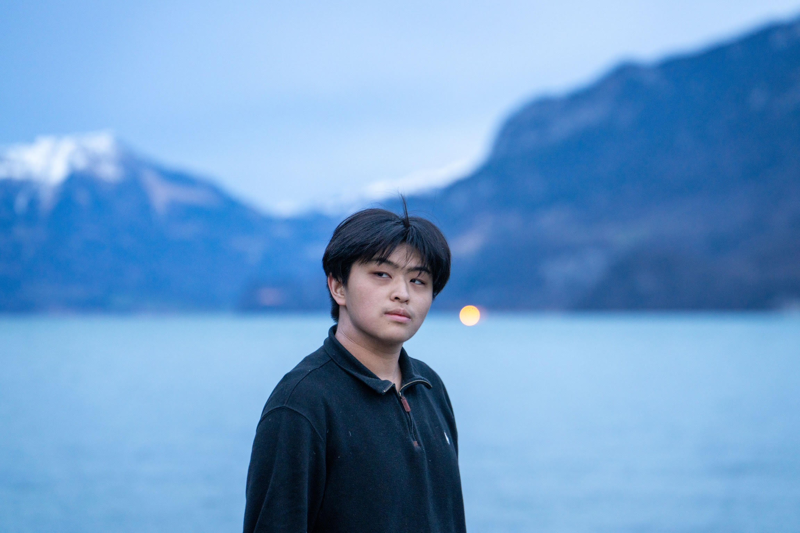

# Hello, hello! 👋

    

## About Me

My name is Renn Su. I'm an undergrad studying Computer Science on the Human-Computer Interaction (HCI) track.
[github](https://github.com/rrsu2026) | [rrsu@stanford.edu](mailto:rrsu@stanford.edu)

## Technical Background 📚

I currently conduct research as part of the **HCI Group** under Prof. Michael Bernstein. My research, _Alexandria: A Library of Human Values for Realtime Re-Ranking of Social Media Feeds_, investigates how we can operationalize LLMs to rank social media feeds with abstract values.

Previously, I worked with the **Stanford Department of Archaeology** to quantitatively and geospatially analyze a Bronze Age excavation site in Henan, China. 🏺

I have also worked as a **software engineer** on a startup named **Inlet** (Harvard Innovation Labs 2022) and as a **student volunteer** for **StartX**. 💡

---

## Projects 💻

### [Alexandria: A Library of Values 📊](https://chromewebstore.google.com/detail/library-of-values-twitter/gifajeihenkpjpahbnjljdappoimclkj)

- Implemented classifiers using **JavaScript**, **Node.js**, **Python** for social media posts based on 154 online value taxonomies, utilizing **NLP** techniques and **machine learning** models
- Optimized pre-trained LLMs (e.g., **GPT-3.5**, **BERT**) and APIs to analyze sentiment and thematic content in social media posts, informing the development of value-centric feed ranking algorithms

### [Lore📱](https://web.stanford.edu/class/cs147/projects/Designing-AI-for-Older-Adults/Lore/)

- Accessibility-centered app for older adults that empowers intergenerational storytelling
- Mobile app implemented using **React Native**. 🏆 _3rd place best personal impact at CS 147 project fair_

### Anyang, Henan Artifact Analysis 🗺️

- Conducted statistical analysis and applied machine learning techniques to data from **400+ archaeological excavations** in Henan, China using **R**, **scikit-learn**, and **Python**; _awarded VPUE Student Research grant_
- Integrated **ArcGIS** satellite imagery and **MATLAB** into research methodology, streamlining geospatial data analysis and visualization processes for a team of archaeology researchers

---

## Fun Facts! 🎉

- 🎨 I am a **digital artist and designer**! I'm a member of the [**Stanford Storyboard Club**](https://stanfordstoryboard.weebly.com/), where my work has been included in the **2023 and 2024 anthologies**. I'm co-Art Director at [**SupplyHer**](https://cardinalservice.stanford.edu/opportunities/stanford-supplyher). On the side, I've run a **small business** where I sold my art as **stickers**!

- ⚖️ I explore the intersections between **technology, law, and ethics** as an **Undergraduate Member Editor** of the [**Stanford Technology Law Review**](https://law.stanford.edu/stanford-technology-law-review-stlr/) (**STLR**).

- 🌍 Outside of learning **programming languages**, I enjoy learning about **world languages and cultures**: **Mandarin**, **French**, **German**, and **Cantonese**. I minor in **German Studies**.
