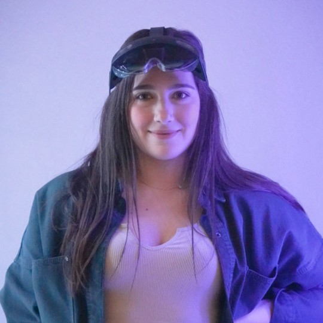

# Hello, I'm Trishia 👋

    
     
    <b>Trishia El Chemaly</b>
     
    Bioengineering PhD Candidate | Co-President of Stanford XR
     
    <a href="https://tchemaly.github.io/">website</a>

## About Me

I'm an engineer, XR developer, and researcher, currently building XR technology that redefines surgery. My skill set spans from research techniques to the development of software and hardware in extended reality, computer vision, and neural engineering. As an interdisciplinary PhD candidate at Stanford, I am fortunate to collaborate with multiple groups including the Surgical Simulation lab, the Incubator for Medical Mixed and Extended Reality at Stanford, the Visualization Lab, the Body Magnetic Resonance Group, and the Salisbury Robotics Lab. 

I am dedicated to scaling access to XR technology and making a meaningful impact globally. I am proudly the co-president of Stanford XR, Stanford University’s student organization for extended reality. My team and I work on building a community that encourages engagement, creates access, and supports innovation in the extended reality space. I spearheaded Immerse The Bay, Stanford University’s first public XR Hackathon, making it the largest XR hackathon in the Bay Area and one of the 3 largest in the world. I also directed Stanford University’s first XR incubator program, to support the next generation of XR innovators by connecting them to our global network of mentors, investors, and industry experts.

## Skills

•   Virtual and augmented reality development  
•   Computer vision and deep learning  
•   Robotics programming   
•   Medical signal and image processing, computational modeling   
•   Experimental handling of neural tissue and analysis of neural recording   

## Relevant Courses

•   CS231A  
•   CS231N  
•   EE267  

## Portfolio

Check my projects on my [website](https://tchemaly.github.io/). 
