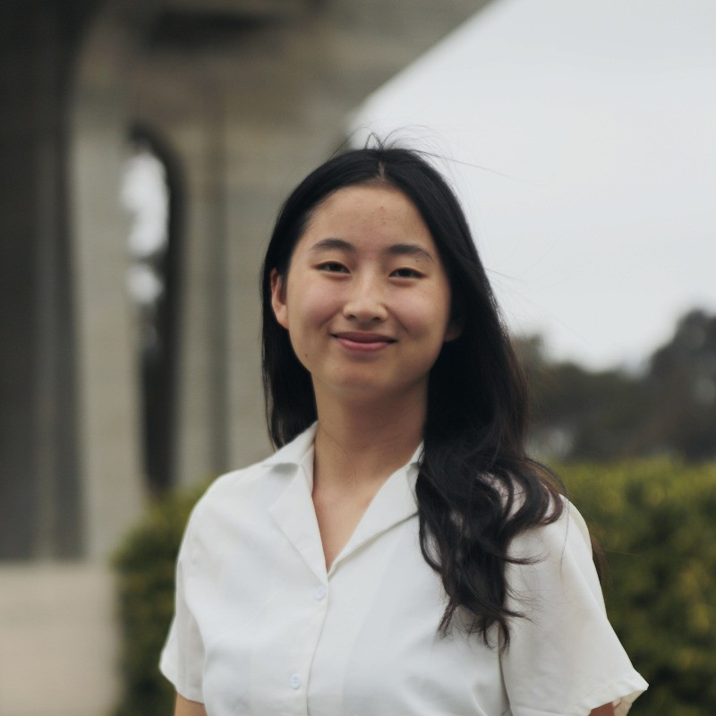

# Hi, I'm Wanning!

Hello! I'm a first year MSCS student specializing in AI. My primary interest is EdTech, particularly applications of NLP to educational settings.

## Experience
**ML Engineer @ Atriium**
- Diarizing and classifying archival material for libraries and cultural institutions

**Software Engineer Intern @ Intuit**
- Developed multimodal AI for telephony

**Fullstack Engineer for Labstream**
- Built a real-time React and Socket.IO interface for 100+ students to remotely control engineering lab equipment

**Research at UCSD MUSAIC**
- Generated natural sounding classical performances from sheet music